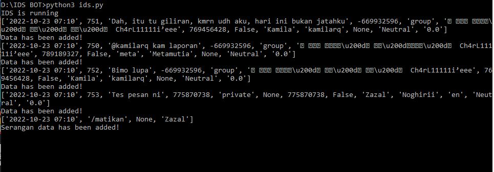
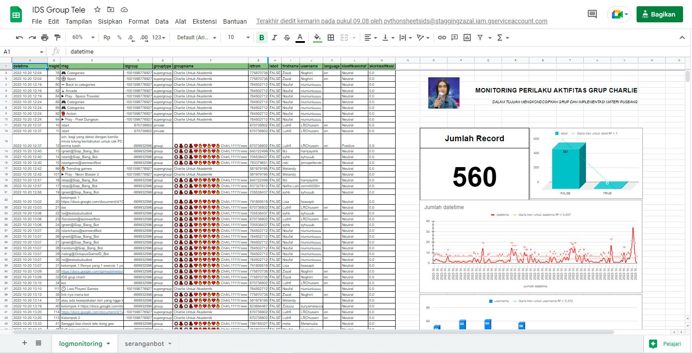

# Bot-For-Monitoring

This is a code to integrate bots that can collect data as agents both in groups and private telegram chats. The data will be pushed and visualized on a google spreadsheet. The concept is almost the same as ELK.

## Log Bot Screenshot

## Monitoring Screenshot

## How to use?

1. Create Google API, and download it as creds.json
2. Create Google Sheet with name "IDS Group Tele", and create two Worksheets with name logmonitoring and seranganbot
3. Make sure you add the API email as an editor
4. Modify creds.json file with your API credentials
5. Create telegram bot with BotFather, and copy your bot API to ids.py (inline bot = telebot.TeleBot("YOURBOTTOKEN"))
6. Run your code, and happy monitoring

## 🔗 CONTACT

## Disclaimer

Devolper Provides no warranty with this software and will not be responsible for any direct or indirect damage caused due to the usage of this tool.
IDS Bot Telegram is built for both Educational and Internal use ONLY.
